# Assertions

Daedalic Test Automation Plugin comes with the following assertion nodes for use in your automated tests:

## Basic Assertions

| Node | Description |
| --- | --- |
| 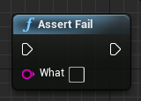 | Finishes the current test as failure. |
| 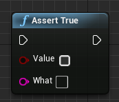 | Expects the specified value to be true. |
| 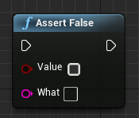 | Expects the specified value to be false. |
| 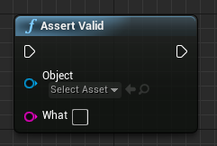 | Expects the specified object to be valid. |
| 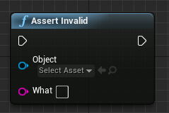 | Expects the specified object not to be valid. |
| 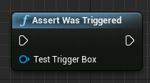 | Expects the specified trigger box to be triggered. |
| 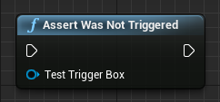 | Expects the specified trigger box not to be triggered. |

## Equality

| Node | Description |
| --- | --- |
| 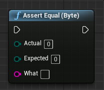 | Expects the specified bytes to be equal. |
| 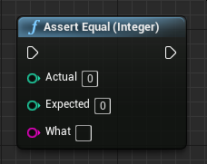 | Expects the specified 32-bit integers to be equal. |
| 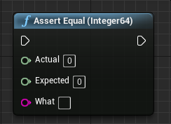 | Expects the specified 64-bit integers to be equal. |
| 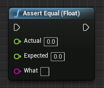 | Expects the specified floats to be (nearly) equal. |
| 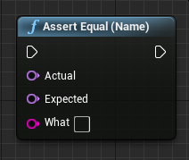 | Expects the specified names to be equal. |
| 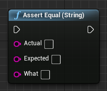 | Expects the specified strings to be equal. |
| 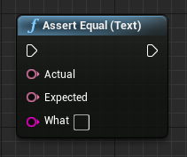 | Expects the specified texts to be equal. |
| 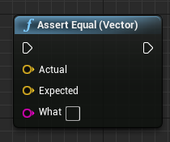 | Expects the specified vectors to be (nearly) equal. |
|  | Expects the specified rotators to be (nearly) equal. |
| 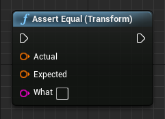 | Expects the specified transforms to be (nearly) equal. |

## Inequality

| Node | Description |
| --- | --- |
| 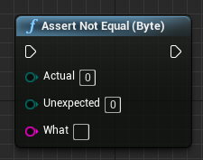 | Expects the specified bytes not to be equal. |
|  | Compares the specified bytes for order. |
| 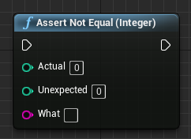 | Expects the specified 32-bit integers not to be equal. |
| 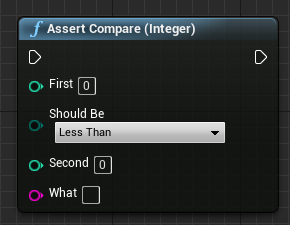 | Compares the specified 32-bit integers for order. |
| 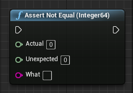 | Expects the specified 64-bit integers not to be equal. |
| 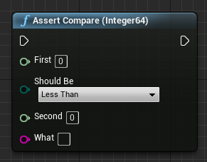 | Compares the specified 64-bit integers for order. |
| 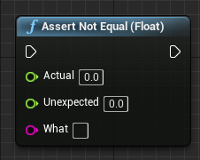 | Expects the specified floats not to be equal. |
| 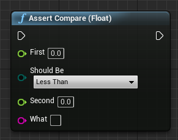 | Compares the specified floats for order. |
| 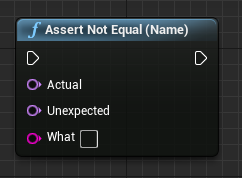 | Expects the specified names not to be equal. |
| 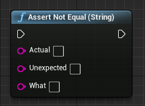 | Expects the specified strings not to be equal. |
| 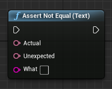 | Expects the specified texts not to be equal. |
| 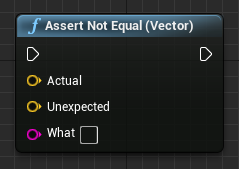 | Expects the specified vectors not to be equal. |
| 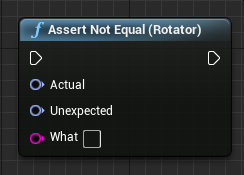 | Expects the specified rotators not to be equal. |
| 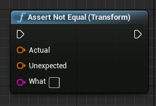 | Expects the specified transforms not to be equal. |

## Range Checks

| Node | Description |
| --- | --- |
| 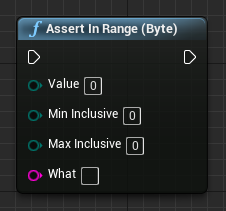 | Expects Value to be between MinInclusive and MaxInclusive. |
| 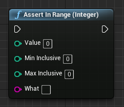 | Expects Value to be between MinInclusive and MaxInclusive. |
| 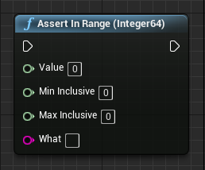 | Expects Value to be between MinInclusive and MaxInclusive. |
| 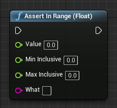 | Expects Value to be between MinInclusive and MaxInclusive. |
| 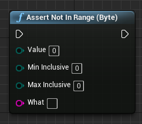 | Expects Value not to be between MinInclusive and MaxInclusive. |
| 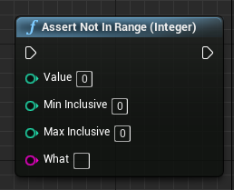 | Expects Value not to be between MinInclusive and MaxInclusive. |
| 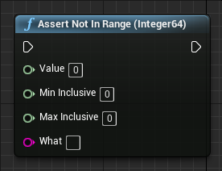 | Expects Value not to be between MinInclusive and MaxInclusive. |
| 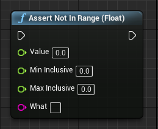 | Expects Value not to be between MinInclusive and MaxInclusive. |

## UMG Widgets

| Node | Description |
| --- | --- |
| 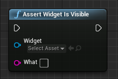 | Expects the specified widget to be valid and visible (e.g. added to viewport, not hidden or collapsed). |
| 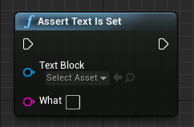 | Expects the specified text not to be empty. |
| 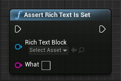 | Expects the specified rich text not to be empty. |
| 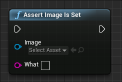 | Expects the specified image to be set up to use a texture or material. |
