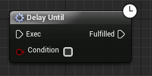
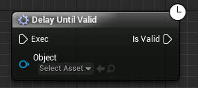
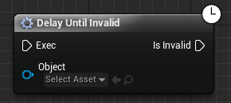
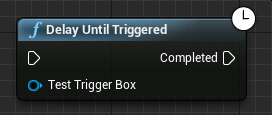
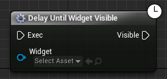
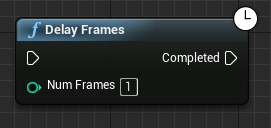

# Delays

Daedalic Test Automation Plugin comes with the following additional delay nodes that you might find useful when building your tests:

| Node | Description |
| --- | --- |
|  | Triggers the output link after the specified condition becomes true. |
|  | Triggers the output link after the specified object becomes valid. |
|  | Triggers the output link after the specified object becomes invalid. |
|  | Triggers the output link after the specified trigger box has been triggered. |
|  | Triggers the output link after the specified widget becomes valid and visible (e.g. added to viewport, not hidden or collapsed). |
|  | Triggers the output link after the specified number of frames. |
