# Daedalic Test Automation Plugin

[](https://github.com/DaedalicEntertainment/ue4-test-automation/blob/develop/LICENSE)

The _Daedalic Test Automation Plugin_ facilitates creating integration tests with the [Gauntlet Automation Framework](https://docs.unrealengine.com/en-US/Programming/Automation/Gauntlet/index.html) of [Unreal Engine 4](https://www.unrealengine.com).

Automated testing, when applied instead of or in addition to manual testing, provides multiple benefits:

* _Clean code._ Automating tests requires the tested code to be very modular, which improves maintainability in general.
* _Fast results._ Running automated tests is usually a lot faster than testing manually, and can be performed unattended.
* _Better coverage._ As a result, we can test more parts of our game when using automated testing than without, allowing manual testers to focus on other parts of the game.
* _Increased stability_. Being able to run automated tests greatly increases the confidence of the development team when applying bigger changes to the code base, allowing them to catch regressions early (e.g. after optimizing performance).

After using the plugin for automating tests of _The Lord of the Rings™: Gollum™_, we decided to share it with the rest of the world. We feel like software testing is far too important not to be supported by automation, and test automation still hasn't fully found its way into game development. We believe that this is party because creating automated tests for games tends to be tedious, and we want to improve on that.

Supported Unreal Engine Versions:

* 4.23


## Contents

1. [Setup](#setup)
    1. [Adding The Plugin](#adding-the-plugin)
    1. [Setting Up The Environment](#setting-up-the-environment)
1. [Creating Tests](#creating-tests)
    1. [Assertions](#assertions)
    1. [Delays](#delays)
    1. [Simulating Input](#simulating-input)
    1. [Test Trigger Boxes](#test-trigger-boxes)
    1. [Test Timeouts](#test-timeouts)
    1. [Test Suite Lifecycle](#test-suite-lifecycle)
    1. [Parameterized Tests](#parameterized-tests)
    1. [Skipping Tests](#skipping-tests)
    1. [Assumptions](#assumptions)
1. [Running Tests](#running-tests)
    1. [Play In Editor](#play-in-editor)
    1. [Automation Window](#automation-window)
    1. [Gauntlet](#gauntlet)
1. [Best Practices](#best-practices)
1. [Bugs, Questions & Feature Requests](#bugs-questions-&-feature-requests)
1. [Development Cycle](#development-cycle)
1. [Contributing](#contributing)
1. [Future Work](#future-work)
1. [License](#license)
1. [References](#references)

## Setup

Note that the plugin relies on Gauntlet, and thus currently requires both a source version of the engine and a C++ Unreal project.

### Adding The Plugin

1. Clone the repository.
1. Close the Unreal Editor.
1. Copy the `DaedalicTestAutomationPlugin` folder to the `Plugins` folder next to your `.uproject` file.
1. Copy the `DaedalicTestAutomationPlugin.Automation` folder to the `Build/Scripts` folder next to your ```.uproject``` file.
1. Right-click your `.uproject` file and select _Generate Visual Studio project files_.
1. Build the resulting solution in Visual Studio.
1. Start the Unreal Editor.
1. Enable the plugin in Edit > Plugins > Daedalic Entertainment.

### Setting Up The Environment

Because the Daedalic Test Automation Plugin uses Gauntlet for running automated tests, but we don't want to force you to modify your version of Unreal Engine, we need to know where your source version of the engine can be found on disk.

Set the `UNREAL_ENGINE_4_PATH` environment variable to the root folder of your source checkout, e.g. the directory that contains files like `Setup.bat` or `GenerateProjectFiles.bat`. 

Note that you might need to restart your shells and/or Visual Studio in order to have your changes take effect.

If everything is set up correctly, `DaedalicTestAutomationPlugin.Automation` will be discovered when generating your project files (because the engine finds it in your Build directory). The project will then use your environment variable to publish its build results to the `Engine\Binaries\DotNET\AutomationScripts` folder your engine, where they can be discovered by the Unreal Automation Tool for running Gauntlet.


## Creating Tests

Daedalic Test Automation Plugin is fully exposed to blueprints in order to allow everyone to easily create tests. Each level represents a _test suite_, which in turn can consist of multiple _tests_.

You'll be using Gauntlet to run one or more test suits, or the Unreal Editor to run a single test suite.


In order to create a new test suite with a single test:

1. Create a new level.
1. Add a _Dae Test Suite Actor_ to the level.
1. Create a _Dae Test Actor_ blueprint (e.g. through right-click in Content Browser > Create Advanced Asset > Test Automation > Test Actor Blueprint).
1. Implement the Arrange, Act and Assert events of the test actor (see below).
1. Add an instance of the test actor blueprint to the level.
1. Add the test actor reference to the list of tests of the test suite actor.

Automated tests in the Daedalic Test Automation Plugin are built with the Arrange-Act-Assert pattern in mind:

* In _Arrange_, you should set up your test environment, get references to required actors and components, and prepare everything for the actual test.
* In _Act_, you should perform the actual action to test. Here, you're allowed to use latent actions, such as delays, to test what you want to test. Because we don't know when you're finished, you have to call _Finish Act_ when you're done.
* In _Assert_, you should use the built-in assertion framework to verify the results of your tests, e.g. check the state of variables or positions of actors.

If any of the assertions performed in the Assert step fail, the test will be marked as failed.


You can verify your test suite by entering PIE and filtering your log by the `LogDaeTest` log category.

```
LogDaeTest: Display: ADaeTestSuiteActor::RunAllTests - Test Suite: DaeTestSuiteActor_1
LogDaeTest: Display: ADaeTestSuiteActor::RunNextTest - Test: BP_TestCalculatorAddsNumbers_2
LogDaeTest: Display: ADaeTestSuiteActor::OnTestSuccessful - Test: BP_TestCalculatorAddsNumbers_2
LogDaeTest: Display: ADaeTestSuiteActor::RunNextTest - All tests finished.
```

You'll also find a handful of example tests in the Content folder of the plugin.

### Assertions

There's a whole lot of _assertion_ nodes for use in your automated tests, including equality and range checks for all basic blueprint types, or verifying the state of UMG widgets. Take a look at [Documentation/Assertions.md](Documentation/Assertions.md) for more details.

### Delays

Daedalic Test Automation Plugin comes with additional _delay_ nodes that you might find useful when building your tests. Take a look at [Documentation/Delays.md](Documentation/Delays.md) for more details.

### Simulating Input

We provide blueprint nodes for simulating _player input_, both actions and axes. Actions will be applied once immediately, while axes will be applied until explicitly reset by applying it again. You can use all actions and axes defined in your input mappings (Edit > Project Settings > Engine > Input).

Simulated input is especially helpful when combined with [Delays](#delays):

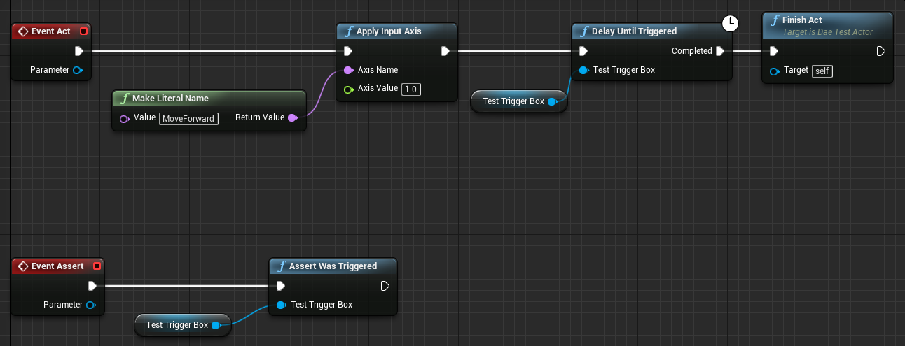

### Test Trigger Boxes

Daedalic Test Automation Plugin ships with a convenience _Dae Test Trigger Box_ that allows you to set up test delays and assertions more quickly. These trigger boxes will just set a flag when triggered, and write a log. Our built-in [delays](Documentation/Delays.md) and [assertions](Documentation/Assertions.md) will use that flag to check if the box has been triggered.

### Test Timeouts

At your _Dae Gauntlet Test Actor_ blueprint (or instance), you can specify a _timeout_ for the test (defaults to 30 seconds).

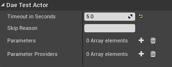

If your test times out during the Act stage, we'll execute all assertions immediately instead of waiting for the Act stage to finish. This allows your test to finish with just warnings instead of errors, in case you just set up some wrong delays, for instance. However, if your assertions actually fail after the timeout, the test will be marked as failed as usual.

```
LogDaeTest: Display: ADaeTestSuiteActor::RunAllTests - Test Suite: DaeTestSuiteActor_1
LogDaeTest: Display: ADaeTestSuiteActor::RunNextTest - Test: BP_TestMoveForward_2
LogDaeTest: Warning: Timed out after 5.000000 seconds
LogDaeTest: Error: Assertion failed - Trigger box DaeTestTriggerBox_1 wasn't triggered
LogDaeTest: Error: ADaeTestSuiteActor::OnTestFailed - Test: BP_TestMoveForward_2, FailureMessage: Assertion failed - Trigger box DaeTestTriggerBox_1 wasn't triggered
LogDaeTest: Display: ADaeTestSuiteActor::RunNextTest - All tests finished.
```

### Test Suite Lifecycle

Instead of just adding a default _Dae Test Suite Actor_ to your level, you can create a test suite blueprint instead (e.g. through right-click in Content Browser > Create Advanced Asset > Test Automation > Test Suite Actor Blueprint).

Test suite blueprints allow you to implement the following _lifecycle events_:

* `BeforeAll`: Executed before running the first test.
* `BeforeEach`: Executed every time before running a test.
* `AfterEach`: Executed every time after running a test.
* `AfterAll`: Executed after running the last test.

After creating your test suite blueprint, you can add instances of that blueprint to your test levels just as you would with the default test suite actor. Then, add test actor references to the list of tests of your test suite as usual.

### Parameterized Tests

In case you want to run the same test multiple times with just slightly different configurations, Daedalic Test Automation Plugin offers _parameterized tests_. You can specify any number of parameters for your test instance (or blueprint).

In order to provide a consistent test API, these parameters have to be of type UObject, so if you have any other type you want to pass in as parameter, you'll need to wrap them with an UObject. Using UObject parameters also enables you to reference other actors in your test level.

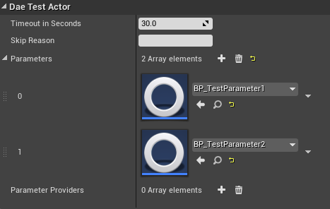

The parameter will be passed to all test events, where you can perform your test actions on them:

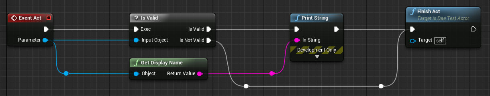

The test will be run once for each parameter, and each test run will be treated exactly as if you'd run a non-parameterized test:

* the test time is reset for each parameter
* BeforeEach and AfterEach are called for each parameter
* test reports include one test per parameter

```
LogDaeTest: Display: ADaeTestSuiteActor::RunAllTests - Test Suite: DaeTestSuiteActor_1
LogDaeTest: Display: ADaeTestSuiteActor::RunNextTest - Test: BP_TestParameterized_TwoParameters - BP_TestParameter1
LogBlueprintUserMessages: [BP_TestParameterized_TwoParameters] BP_TestParameter1
LogDaeTest: Display: ADaeTestSuiteActor::OnTestSuccessful - Test: BP_TestParameterized_TwoParameters - BP_TestParameter1
LogDaeTest: Display: ADaeTestSuiteActor::RunNextTest - Test: BP_TestParameterized_TwoParameters - BP_TestParameter2
LogBlueprintUserMessages: [BP_TestParameterized_TwoParameters] BP_TestParameter2
LogDaeTest: Display: ADaeTestSuiteActor::OnTestSuccessful - Test: BP_TestParameterized_TwoParameters - BP_TestParameter2
LogDaeTest: Display: ADaeTestSuiteActor::RunNextTest - All tests finished.
```

Sometimes, you'll want to provide the test parameters dynamically, e.g. when you need to convert them to UObjects. Daedalic Test Automation Plugin features _Dae Test Parameter Provider Actors_ for this: You can create parameter provider blueprints (e.g. through right-click in Content Browser > Create Advanced Asset > Test Automation > Test Parameter Provider Actor Blueprint). Then, you can override the `GetParameters` function to provide parameters for your test.

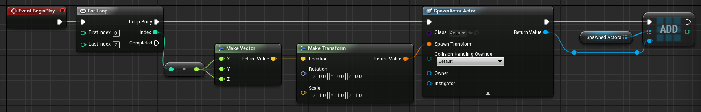
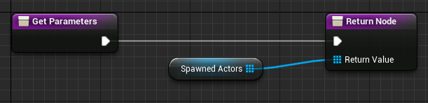

Finally, you'll have to add your provider to your test level, and to your test:

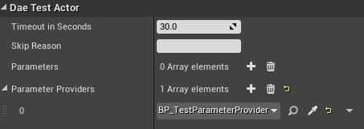

For each parameterized test, all parameter providers are applied exactly once, before the first run of that test.

### Skipping Tests

If you want to temporarily _disable_ a test, you may specify a Skip Reason at your 
_Dae Test Actor_ blueprint (or instance). Setting the Skip Reason to a non-empty string will cause the test to be skipped with the specified message. We don't provide a way of skipping a test without specifying a reason, because we feel that people should always know why a test is currently disabled.

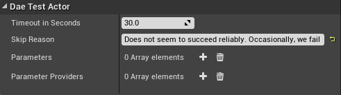

Skipped tests will be marked as neither successful nor failed, and will show up explicitly as skipped in test reports.

```
LogDaeTest: Display: ADaeTestSuiteActor::RunAllTests - Test Suite: DaeTestSuiteActor_1
LogDaeTest: Display: ADaeTestSuiteActor::RunNextTest - Test: BP_TestClimbLedge
LogDaeTest: Display: ADaeTestSuiteActor::OnTestSkipped - Test: BP_TestClimbLedge, SkipReason: Does not seem to succeed reliably. Occasionally, we fail to get a hold of the ledge after jumping if done automatically by the test.
LogDaeTest: Display: ADaeTestSuiteActor::RunNextTest - All tests finished.
```

### Assumptions

You can also specify dynamic conditions for skipping a test through _assumptions_. This extends the above test model from Arrange-Act-Assert to Assume-Arrange-Act-Assert: You can make an arbitrary number of assumptions before even arranging up your test (e.g. check the value of some configuration variable or command-line parameter, or check the current runtime platform).

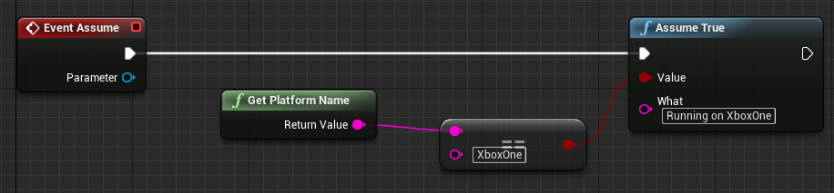

If any of your assumptions fail, the test will be skipped instead of being marked as failure:

```
LogDaeTest: Display: ADaeTestSuiteActor::RunAllTests - Test Suite: DaeTestSuiteActor_1
LogDaeTest: Display: ADaeTestSuiteActor::RunNextTest - Test: BP_TestAssume_2
LogDaeTest: Display: ADaeTestSuiteActor::OnTestSkipped - Test: BP_TestAssume_2, SkipReason: Assumption failed - Running on XboxOne - Expected: True, but was: False
LogDaeTest: Display: ADaeTestSuiteActor::RunNextTest - All tests finished.
```


## Running Tests

### Play In Editor

You can run each test suite by just entering _Play In Editor_, if "Run in PIE" is checked for that test suite (default).

### Automation Window

In order to run multiple tests, you can use the _Automation window_ of the session frontend of the Unreal Editor (Window > Test Automation). There, your tests will be shown under the category DaedalicTestAutomationPlugin. 

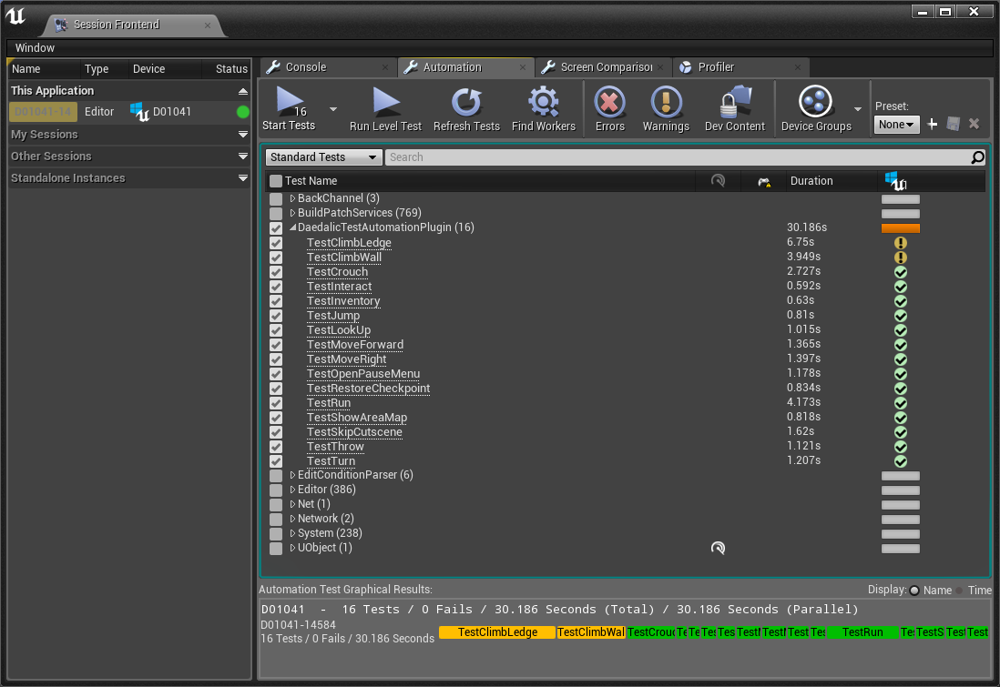

By default, the plugin will look in your `Maps/AutomatedTests` content folder for tests, but you can change that from Edit > Project Settings > Plugins > Daedalic Test Automation Plugin.

### Gauntlet

In order to run multiple tests from command-line (e.g. as part of your CI/CD pipeline), we recommend using _Gauntlet_, which can be run by passing a specific set of parameters to the Unreal Automation Tool (UAT).


Here's an example command line to get started:

```
"C:\Projects\UnrealEngine\Engine\Build\BatchFiles\RunUAT.bat"
RunUnreal
-project="C:\Projects\UnrealGame\UnrealGame.uproject"
-scriptdir="C:\Projects\UnrealGame"
-platform=Win64
-configuration=Development
-build=editor
-test="DaedalicTestAutomationPlugin.Automation.DaeGauntletTest"
```

In the command line above:

* `RunUAT.bat` starts the Unreal Automation Tool (UAT).
* `RunUnreal` tells the UAT to run Gauntlet.
* `-project` specifies the full path to your Unreal project file.
* `-scriptdir` tells UAT to compile and load your UAT extensions (in this case, at least `DaedalicTestAutomationPlugin.Automation`).
* `-build` tells Gauntlet to use your editor project instead of a packaged build.
* `-test` tells Gauntlet to use our custom controller (which in turn runs the test suites).

This will run all tests the plugin finds in your Test Map Path (see [Automation Window](#automation-window)). Gauntlet will tell you which tests have been run, along with their results. It will also tell you where to find the log files of the test runs (artifacts). You can specify `-verbose` as additional parameter to the UAT to get even more feedback.

Because documentation on Gauntlet is still sparse, you occasionally might want to check back on the original source files to learn about supported parameters and internal workings:

* `Gauntlet.UnrealBuildSource.ResolveBuildReference` will tell you more about valid options for the `-build` parameter (e.g. running a staged build)
* `EpicGame.EpicGameTestConfig` (and its base classes) is used by our `DaedalicTestAutomationPlugin.Automation.DaeTestConfig` and can tell you more about valid options for the `-test` parameter.
* `Gauntlet.ArgumentWithParams.CreateFromString` is used for actually parsing the `-test` parameter.

You can also specify additional parameters along with the `test` parameter for the test run:

* `JUnitReportPath`: Generates a JUnit XML report to publish with your CI/CD pipeline.
* `TestName`: Runs the specified test, only, instead of all tests.

Example:

```
"C:\Projects\UnrealEngine\Engine\Build\BatchFiles\RunUAT.bat"
RunUnreal
-project="C:\Projects\UnrealGame\UnrealGame.uproject"
-scriptdir="C:\Projects\UnrealGame"
-platform=Win64
-configuration=Development
-build=editor
-test="DaedalicTestAutomationPlugin.Automation.DaeGauntletTest(JUnitReportPath=C:\Projects\UnrealGame\Saved\junit-report.xml)"
```

When generating JUnit reports, the plugin uses a standardized format (based on `org.junit.platform.reporting.legacy.xml.XmlReportWriter.writeTestsuite`), allowing you to publish the report just as you would when using JUnit. Here's an example of how the results look like when published with Jenkins:

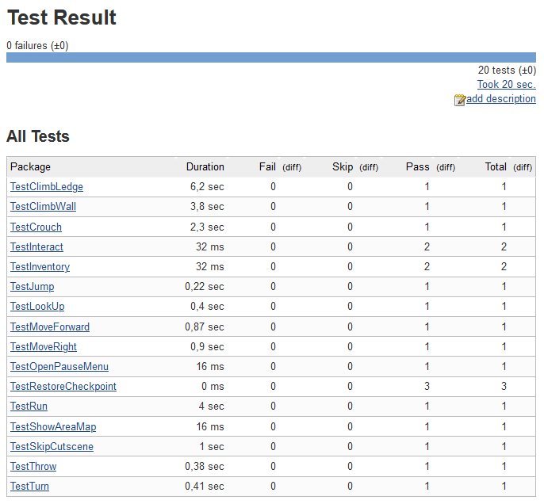


## Best Practices

There are a few best practices we learned when writing tests, and we want to share those with you. We also recommend taking a closer look at the [References](#References) below, which go into more detail.

1. _Keep your tests small._ Large tests that fail don't tell you much about the actual problem, especially when they contain multiple assertions. Try creating multiple small tests instead.
1. _Mock your dependencies._ Testing complex objects often forces you to violate the previous rule. Consider refactoring the code under test by splitting up your classes, and inject mock objects for dependencies where possible.
1. _Keep your tests fast._ Slow tests will eventually keep your team from running them. Even integration tests should never take much longer than a few seconds.
1. _Use meaningful test names._ Good test names can tell you much about the issue at a very first glance. Consider even using a common pattern for all tests, i.e. including the object and function under test, and the assertion you're making.
1. _Don't repeat yourself._ As with all software development, don't copy and paste your test logic. Use BeforeAll/BeforeEach/AfterEach/AfterAll and/or move test logic to function libraries where possible.


## Bugs, Questions & Feature Requests

Daedalic Test Automation Plugin is still under heavy development. Whenever you're experiencing issues, missing a feature, or you just don't understand a part of the plugin, after verifying that you are using the [latest version](https://github.com/DaedalicEntertainment/ue4-test-automation/releases) and having checked whether a [similar issue](https://github.com/DaedalicEntertainment/ue4-test-automation/issues) has already been reported, feel free to [open a new issue](https://github.com/DaedalicEntertainment/ue4-test-automation/issues/new). In order to help us resolving your problem as fast as possible, please include the following details in your report:

* Steps to reproduce
* What happened?
* What did you expect to happen?

After being able to reproduce the issue, we'll look into fixing it immediately.


## Development Cycle

We know that using this plugin in production requires you to be completely sure about stability and compatibility. Thus, new releases are created using [Semantic Versioning](http://semver.org/). In short:

* Version numbers are specified as MAJOR.MINOR.PATCH.
* MAJOR version increases indicate incompatible API changes.
* MINOR version increases indicate added functionality in a backwards compatible manner.
* PATCH version increases indicate backwards compatible bug fixes.

You'll always find all available releases and their respective release notes at:

https://github.com/DaedalicEntertainment/ue4-test-automation/releases


## Contributing

You want to contribute to Daedalic Test Automation Plugin? Great! Take a look at [Contributing](CONTRIBUTING.md) to get started right away!


## Future Work

While the plugin already serves as solid base for creating automated tests, there's still a lot of things we'd like to add in the future. If you're interested in more details, take a look at the [GitHub milestones](https://github.com/DaedalicEntertainment/ue4-test-automation/milestones).


## License

Daedalic Test Automation Plugin is released under the [MIT License](https://github.com/DaedalicEntertainment/ue4-test-automation/blob/develop/LICENSE).


## References

* Masella, Robert. Rare, Ltd. Automated Testing of Gameplay Features in 'Sea of Thieves'. https://www.gdcvault.com/play/1026366/Automated-Testing-of-Gameplay-Features, 2019.
* Fray, Andrew. Spry Fox. Practical Unit Tests. https://www.gdcvault.com/play/1020353/Practical-Unit, 2014.
* The JUnit Team. JUnit 5 User Guide. https://junit.org/junit5/docs/current/user-guide, 2020.
