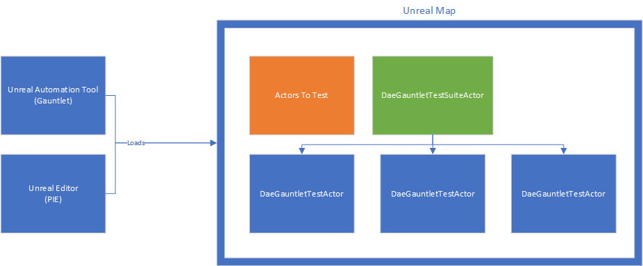
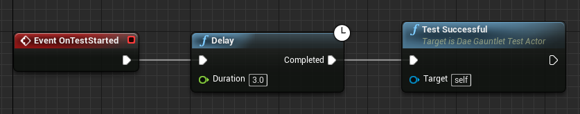
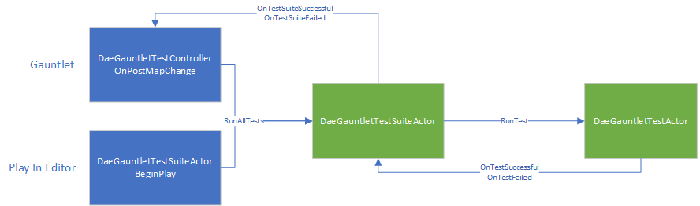

# Daedalic Test Automation Plugin

[](https://github.com/DaedalicEntertainment/ue4-test-automation/blob/develop/LICENSE)

The _Daedalic Test Automation Plugin_ facilitates creating integration tests with the [Gauntlet Automation Framework](https://docs.unrealengine.com/en-US/Programming/Automation/Gauntlet/index.html) of [Unreal Engine 4](https://www.unrealengine.com).

After using the plugin for automating tests of _The Lord of the Rings™: Gollum™_, we decided to share it with the rest of the world. We feel like software testing is far too important not to be supported by automation, and test automation still hasn't fully found its way into game development. We believe that this is party because creating automated tests for games tends to be tedious, and we want to improve on that.

## Setup

Note that the plugin relies on Gauntlet, and thus currently requires both a source version of the engine and a C++ Unreal project.


### Adding The Plugin

1. Clone the repository.
1. Close the Unreal Editor.
1. Copy the ```DaedalicTestAutomationPlugin``` folder to the ```Plugins``` folder next to your ```.uproject``` file.
1. Copy the ```DaedalicTestAutomationPlugin.Automation``` folder to the ```Build/Scripts``` folder next to your ```.uproject``` file.
1. Right-click your ```.uproject``` file and select _Generate Visual Studio project files_.
1. Build the resulting solution in Visual Studio.
1. Start the Unreal Editor.
1. Enable the plugin in Edit > Plugins > Daedalic Entertainment.

### Setting Up The Environment

Because the Daedalic Test Automation Plugin uses Gauntlet for running automated tests, but we don't want to force you to modify your version of Unreal Engine, we need to know where your source version of the engine can be found on disk.

Set the ```UNREAL_ENGINE_4_PATH``` environment variable to the root folder of your source checkout, e.g. the directory that contains files like ```Setup.bat``` or ```GenerateProjectFiles.bat```. 

Note that you might need to restart your shells and/or Visual Studio in order to have your changes take effect.

If everything is set up correctly, ```DaedalicTestAutomationPlugin.Automation``` will be discovered when generating your project files (because the engine finds it in your Build directory). The project will then use your environment variable to publish its build results to the ```Engine\Binaries\DotNET\AutomationScripts``` folder your engine, where they can be discovered by the Unreal Automation Tool for running Gauntlet.

## Creating Tests

Daedalic Test Automation Plugin is fully exposed to blueprints in order to allow everyone to easily create tests. Each level represents a _test suite_, which in turn can consist of multiple _tests_.

You'll be using Gauntlet to run one or more test suits, or the Unreal Editor to run a single test suite.



In order to create a new test suite with a single test:

1. Create a new level.
1. Add a _Dae Gauntlet Test Suite Actor_ to the level.
1. Create a _Dae Gauntlet Test Actor_ blueprint.
1. Implement the OnTestStarted event of the test actor.
1. Add an instance of the test actor blueprint to the level.
1. Add the test actor reference to the list of tests of the test suite actor.

The ```DaeGauntletTestActor``` class provides an API for implementing the individual tests. Most notably, you'll have to call TestSuccessful or TestFailed, depending on your test result. More convenience functions for implementing tests will be added in the future.



You can verify your test suite by entering PIE and filtering your log by the ```LogDaeTest``` log category.

```
LogDaeTest: ADaeGauntletTestSuiteActor::RunAllTests - Test Suite: DaeGauntletTestSuiteActor_1
LogDaeTest: ADaeGauntletTestSuiteActor::RunNextTest - Test: BP_TestAlwaysSuccessful
LogDaeTest: ADaeGauntletTestSuiteActor::TestSuccessful - Test: BP_TestAlwaysSuccessful
LogDaeTest: ADaeGauntletTestSuiteActor::RunNextTest - All tests finished.
```

## Running Tests

You can run each test suite by just entering Play In Editor, if "Run in PIE" is checked for that test suite (default).

In order to run multiple tests, we recommend using Gauntlet, which can be run by passing a specific set of parameters to the Unreal Automation Tool (UAT).



Here's an example command line to get started:

```
"C:\Projects\UnrealEngine\Engine\Build\BatchFiles\RunUAT.bat"
RunUnreal
-project="C:\Projects\UnrealGame\UnrealGame.uproject"
-scriptdir="C:\Projects\UnrealGame"
-platform=Win64
-configuration=Development
-build=editor
-test="DaedalicTestAutomationPlugin.Automation.DaeGauntletTest(map=TestMoveForward)"
```

In the command line above:

* ```RunUAT.bat``` starts the Unreal Automation Tool (UAT).
* ```RunUnreal``` tells the UAT to run Gauntlet.
* ```-project``` specifies the full path to your Unreal project file.
* ```-scriptdir``` tells UAT to compile and load your UAT extensions (in this case, at least ```DaedalicTestAutomationPlugin.Automation```).
* ```-build``` tells Gauntlet to use your editor project instead of a packaged build.
* ```-test``` tells Gauntlet to use our custom controller (which in turn runs the test suites), and to load the specified map.

Because documentation on Gauntlet is still sparse, you occasionally might want to check back on the original source files to learn about supported parameters and internal workings:

* ```Gauntlet.UnrealBuildSource.ResolveBuildReference``` will tell you more about valid options for the ```-build``` parameter (e.g. running a staged build)
* ```EpicGame.EpicGameTestConfig``` (and its subclasses) is used by our ```DaedalicTestAutomationPlugin.Automation.DaeGauntletTest``` and can tell you more about valid options for the ```-test``` parameter.
* ```Gauntlet.ArgumentWithParams.CreateFromString``` is used for actually parsing the ```-test``` parameter.

Gauntlet will tell you which tests have been run, along with their results. It will also tell you where to find the log files of the test runs (artifacts). You can specify ```-verbose``` as additional parameter to the UAT to get even more feedback.

## Development Cycle

We know that using this plugin in production requires you to be completely sure about stability and compatibility. Thus, new releases are created using [Semantic Versioning](http://semver.org/). In short:

* Version numbers are specified as MAJOR.MINOR.PATCH.
* MAJOR version increases indicate incompatible API changes.
* MINOR version increases indicate added functionality in a backwards compatible manner.
* PATCH version increases indicate backwards compatible bug fixes.

## Bugs & Feature Requests

Daedalic Test Automation Plugin is still under heavy development. Whenever you're experiencing issues or are missing a feature, after verifying that you are using the [latest version](https://github.com/DaedalicEntertainment/ue4-test-automation/releases) and having checked whether a [similar issue](https://github.com/DaedalicEntertainment/ue4-test-automation/issues) has already been reported, feel free to [open a new issue](https://github.com/DaedalicEntertainment/ue4-test-automation/issues/new). In order to help us resolving your problem as fast as possible, please include the following details in your report:

* Steps to reproduce
* What happened?
* What did you expect to happen?

After being able to reproduce the issue, we'll look into fixing it immediately.


## License

Daedalic Test Automation Plugin is released under the [MIT License](https://github.com/DaedalicEntertainment/ue4-test-automation/blob/develop/LICENSE).
